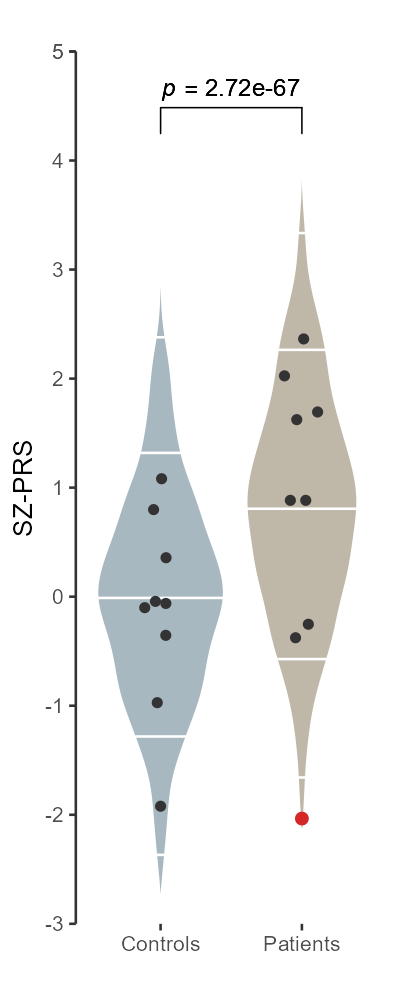
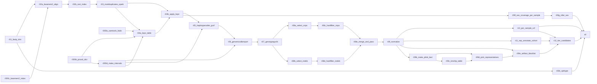
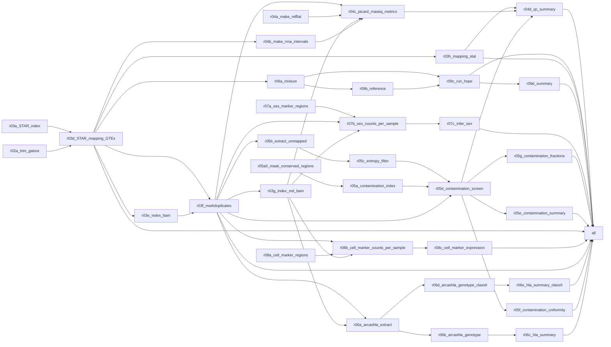
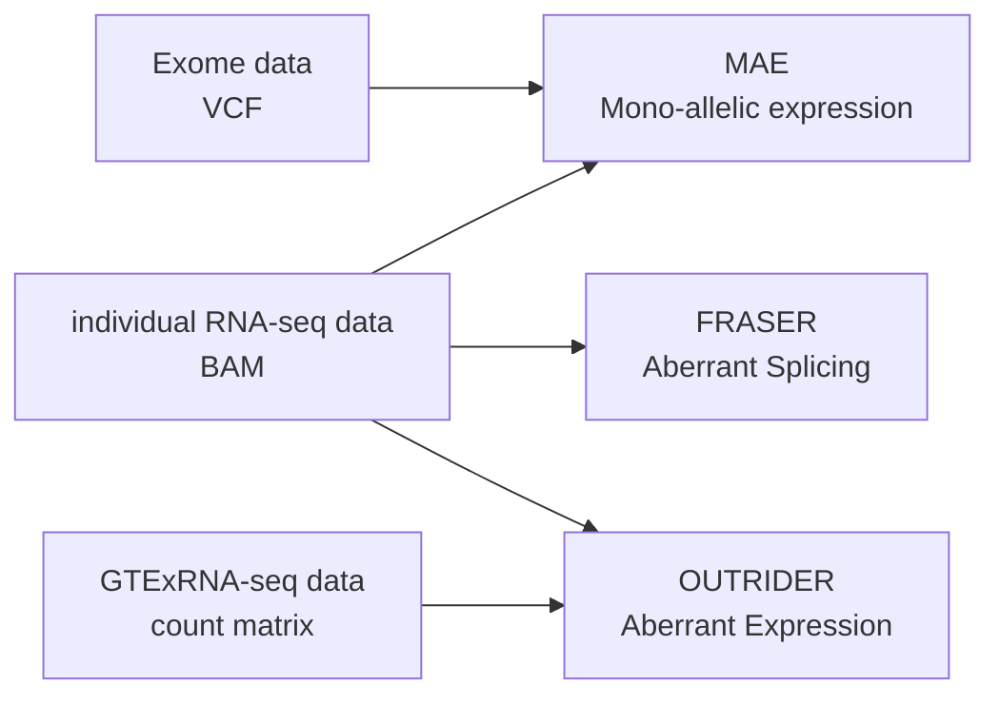
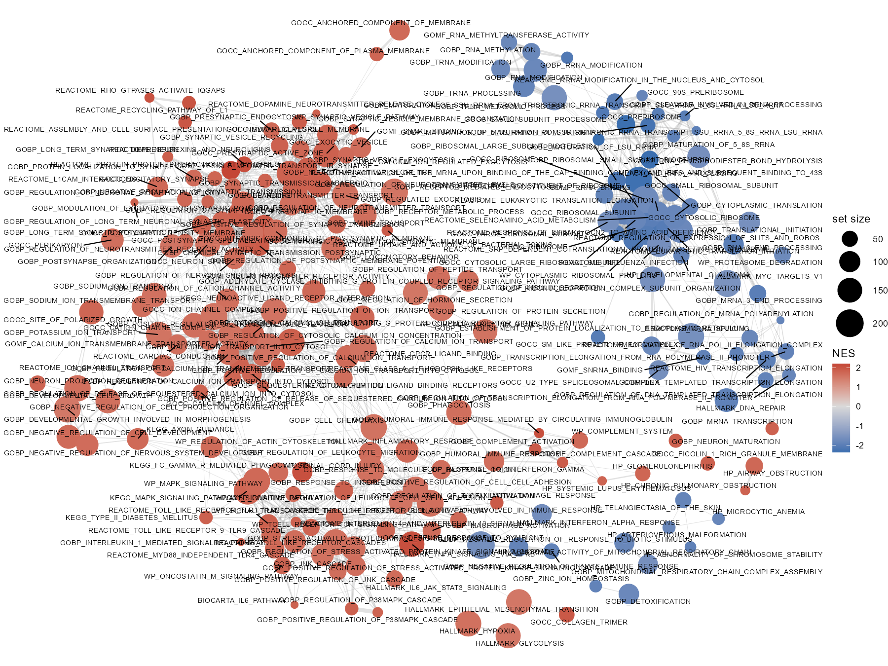
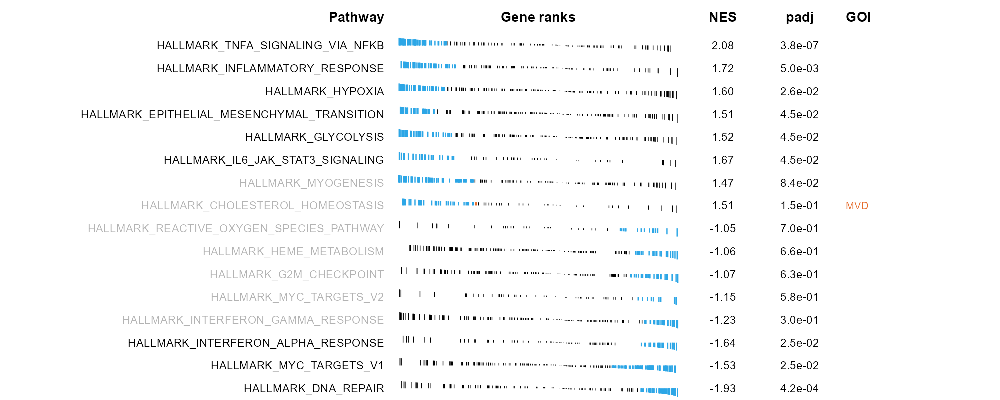
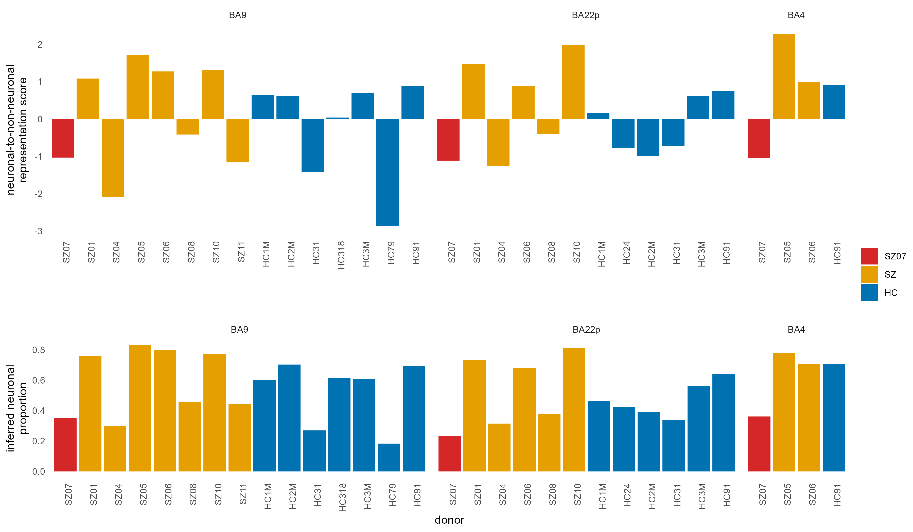
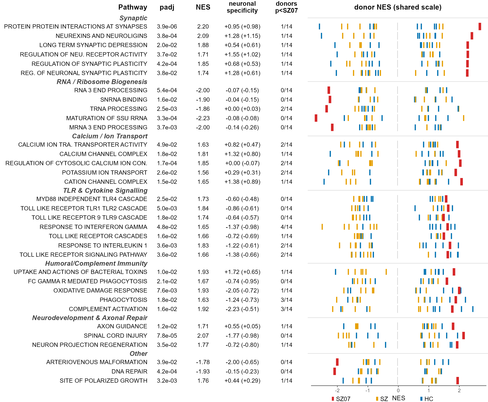

# Joint Exome/Transcriptome Mutation Prioritisation in Low SZ-PRS Brain

*Link to the study*
* -- While the study was motivated by availavility of transcriptome data for this low SZ-PRS brain, the repo is just about exome mutations prioritisation and the using joint RNA-seq and exome data for the DROP pipeline ([Yépez et al. 2021](https://doi.org/10.1038/s41596-020-00462-5)). The brain context is implied in many parts of the workflow, but not necessary.

## Ia. Variant-calling and annotation: reference data acquisition and post-processing
*scripts\lpb-exome-priritisation-collect-data.sh*<br>
A bash pipeline designed to assemble all reference and annotation resources required by the variant-calling and annotation workflow. The script is idempotent, supports atomic resumption after interruption, and produces a manifest (TSV format) recording each managed file's path, size, SHA-256 hash, source URL, and validation status. Tested on Ubuntu, 6 vCPUs, 96 GB RAM environment.

Usage:
```sh
sudo chmod +x lpb-exome-pririotisation-collect-data.sh
sudo env BUILD_DECONV_REFERENCE=1 bash lpb-exome-prioritisation-collect-data.sh # or w/o 'env BUILD_DECONV_REFERENCE=1' if not needed
```
The disk space requirement: ~350Gb for the reference data (without scRNAseq for deconvolution, expect ~40Gb per dataset) + ~12Gb per exome. Root priveledges are required only to run apptainer for building the arcasHLA reference.

### Under the hood
#### 1. Reference genome and known-sites VCFs
The GRCh38 reference assembly with ALT contigs (Homo_sapiens_assembly38.fasta) and its FAI/dict indices were obtained from the Broad Institute's public Google Cloud bucket (gcp-public-data--broad-references/hg38/v0). Known-sites VCFs for GATK BQSR — HapMap 3.3, the Mills and 1000 Genomes gold-standard indels, and dbSNP 138 — were retrieved from the same source.

#### 2. Functional annotation infrastructure
Ensembl VEP cache release 112 was downloaded from ftp.ensembl.org. VEP plugin source code was cloned from two repositories: the official Ensembl VEP_plugins repository pinned to release/115 (required for dbNSFP v5 column-layout compatibility), and the LOFTEE plugin from the konradjk/loftee repository on the grch38 branch. To accommodate VEP's single-directory plugin-loading model, all .pm files from both repositories were copied into a single canonical directory (plugins/flat/); copies (rather than symlinks) avoid Singularity bind-mount path-resolution failures.

#### 3a. Plugin data resources
- **LOFTEE** ([Karczewski et al. 2020](https://doi:10.1038/s41586-020-2308-7)). LOFTEE supporting data (human ancestor reference, GERP conservation BigWig, and SQL conservation database) were obtained from personal.broadinstitute.org, with aria2 used preferentially for resilience against intermittent peering issues. Source of information for the tier A variants (see below).
- **SpliceAI** ([Jaganathan et al. 2019](https://doi.org/10.1016/j.cell.2018.12.015)) single-nucleotide-variant scores. Were downloaded from the Ensembl FTP (Ensembl MANE GRCh38 release 110 mirror) under Illumina's research-use license. Source of information for the tier A variants.
- **SpliceAI indel scores**. Were obtained *manually* via the Illumina BaseSpace CLI (project 66029966) due to licensing constraints, academic use. Source of information for the tier A variants.
- **AlphaMissense** ([Cheng et al. 2023](https://doi.org/10.1126/science.adg7492)) scores (AlphaMissense_hg38.tsv.gz). Were obtained from the DeepMind public bucket and tabix-indexed. Source of information for the tier B variants.
- **REVEL** ([Ioannidis et al. 2016](https://doi.org/10.1016/j.ajhg.2016.08.016)) **scores (May 2021 release with Ensembl transcript IDs)**. Downloaded manually from https://sites.google.com/site/revelgenomics/downloads. The panel require explicit transformation to be readable by VEP's REVEL plugin: (i) the published CSV is converted to TSV, (ii) chromosome names are prefixed with "chr" to match the reference assembly's UCSC-style naming, (iii) the column-header line is prefixed with "#" and the file is indexed via tabix -c '#' rather than tabix -S 1, ensuring tabix -h queries return the header line as expected by the plugin's column-detection routine. Two automated sanity checks validate the resulting file: a BRCA1 lookup at chr17:43106478 and a header-retrieval test. Data were used under non-commercial research license. Source of information for the tier B variants.
- **CADD** v1.7 SNV and indel scores ([Rentzsch et al. 2019](https://doi.org/10.1093/nar/gky1016)). Were retrieved from the University of Washington's CADD non-commercial license distribution.
- **dbNSFP** v5.3.1a (academic-use branch) ([Liu et al. 2011](https://doi.org/10.1002/humu.21517) & [Liu et al. 2020](https://doi.org/10.1186/s13073-020-00803-9)). A collection of functional annotations and mutation effect prediction scores. Was supplied *manually* from genos.us (registration [here](https://www.dbnsfp.org/download)).

#### 3b. Custom Singularity image for the VEP annotation
This workflow uses a custom Singularity image for the VEP annotation step instead of the stock ensemblorg/ensembl-vep:release_112.0 container. The image is built from the official Ensembl VEP 112 container, with samtools added for LOFTEE support. LOFTEE requires samtools faidx during annotation, especially for checks involving the ancestral allele FASTA. Without samtools, VEP may still run, but LOFTEE can emit warnings such as Can't exec "samtools" and may produce incomplete or incorrect LoF, LoF_filter, and LoF_flags annotations. In particular, variants that should be downgraded by LOFTEE filters such as ANC_ALLELE may otherwise remain incorrectly classified as high-confidence LoF. The custom image is built once and stored as a local .simg file. The image preserves the official VEP 112 environment and only adds the missing runtime dependency required by LOFTEE.

#### 4. Population-frequency annotation
gnomAD v4.1 exome sites VCFs were downloaded per chromosome (autosomes plus X and Y; ~184 GB total). A helper script (gnomad_strip_concat.sh) is generated by the script and auto-invoked to strip each per-chromosome VCF to relevant AF columns (AF, AF_nfe, AF_afr, AF_amr, AF_eas, AF_sas, AF_fin, AF_asj, nhomalt, AC, AN) using bcftools 1.19 in parallel, concatenating the stripped files into a single bgzipped VCF (~30 GB final), and removing per-chromosome originals as each was processed to bound peak disk usage. The gnomAD constraint table (LOEUF and pLI metrics) is downloaded separately.

#### 5. Clinical-significance annotation
ClinVar GRCh38 was retrieved from a dated NCBI archive snapshot (archive_2.0/2026/clinvar_20260426.vcf.gz). ClinVar is attached to variants in the VEP step via --custom annotation, which copies the CLNSIG (clinical significance), CLNDN (disease name), CLNREVSTAT (review status), and CLNDISDB (disease database cross-references) INFO fields from the ClinVar record at matching coordinates onto the variant being annotated.

#### 6. Gene panels
*all downloaded manually*<br>
- **SureSelectXT Human All Exon V8 capture-kit BED file** (S33266436_Regions.bed & S33266436_Regions.padded100.interval_list). The capture-kit BED file is supplied externally from [the wet-laboratory provider](https://earray.chem.agilent.com/suredesign/search/entity.htm).
- **SCHEMA, BipEx, and ASC**. Schizophrenia ([Singh et al. 2022](https://doi.org/10.1038/s41586-022-04556-w)), bipolar ([Palmer et al. 2022](https://doi.org/10.1038/s41588-022-01034-x)), and ASD ([Satterstrom et al. 2020](https://doi.org/10.1016/j.cell.2019.12.036)) gene-burden results were obtained as TSV files from the [SCHEMA](https://atgu-exome-browser-data.s3.amazonaws.com/SCHEMA/SCHEMA_gene_results.tsv.bgz), [BipEx](https://atgu-exome-browser-data.s3.amazonaws.com/BipEx/BipEx_gene_results.tsv.bgz), and [ASC](https://atgu-exome-browser-data.s3.amazonaws.com/ASC/ASC_gene_results.tsv.bgz) web applications, respectively. The gene results were joined to HGNC symbols via the gnomAD constraint table (Ensembl gene-ID match) for downstream gene-symbol-based filtering (tier C).
- **The DDG2P / Genomics England PanelApp panel (ID 484)**. The panel was retrieved via [the panel's TSV download endpoint](https://panelapp.genomicsengland.co.uk/api/v1/panels/484/), with a JSON-API fallback and automated JSON-to-TSV conversion.

#### 7. (optional) scRNA-seq reference for deconvolution
run the script with the set BUILD_DECONV_REFERENCE flag:
```sh
sudo env BUILD_DECONV_REFERENCE=1 DECONV_REFERENCES="siletti_cortex" bash ./lpb-exome-prioritisation-collect-data.sh
```
Section 10 is an optional stage (off by default; enabled with `BUILD_DECONV_REFERENCE=1`) that produces single-cell reference panels for the RNA-seq pipeline's cell-type deconvolution step. It is unrelated to the exome work and lives in this script only because this is the project's central data-provisioning script.

**Architecture**. The 10 section is a thin *driver*. The actual recipes live in a sibling folder, `scripts_to_make_deconv_reference/`, one self-contained Python script per reference and the common part in *scripts/scripts_to_make_deconv_reference/_deconv_common.py*. The driver discovers every `*.py` there (skipping `_`-prefixed library modules), optionally restricts to a subset via `DECONV_REFERENCES`, and runs each one. Adding a new reference means dropping in a new script; the driver never changes. Before running any builder, the driver ensures an isolated Python venv at `$DECONV_DIR/venv` and installs `anndata h5py scipy pandas numpy` into it. The venv is created and populated once and reused on subsequent runs; every builder is invoked with the venv's interpreter so the dependencies propagate to all of them.

**What each builder does.** Reads one or more large single-cell `.h5ad` source files (staged locally under `$DECONV_SOURCE_DIR`, or resolved from CELLxGENE when networked), backed so the expression matrix is never fully loaded; filters and subsamples cells; collapses the source annotations into the target cell classes via an explicit, auditable mapping; and writes a uniform "canonical" reference — `matrix.mtx.gz`, `features.tsv.gz`, `cells.tsv.gz`, `provenance.json` — that the downstream deconvolution consumes identically regardless of which reference it came from. Each builder is internally idempotent (skips its own download and build if the outputs already exist), so re-runs are cheap.

The section produces reference data in in its own folder under `$DECONV_OUT_ROOT`:
- `siletti_cortex` — adult human neocortex, neuronal vs non-neuronal, for the SZ07 composition analysis from the Siletti et al dataset ([Siletti et al 2023](https://doi.org/10.1126/science.add7046)).

#### 8. Validation
Final completeness validation iterates over expected files, confirming non-zero size and presence of required indices (.tbi for VCF/TSV.gz, .fai/.dict for FASTA). Version coherence between VEP cache, plugin branch, and dbNSFP release is enforced at startup. Post-processing failures (REVEL conversion, SCHEMA HGNC join, gnomAD strip+concat, plugin flattening) propagate to the script's exit code.

## Ib. Variant-calling and annotation: pipeline
*scripts\lpb-exome-prioritisation-pipe.smk*<br>
A Snakemake workflow processes paired-end whole-exome sequencing data from raw FASTQ to tier-classified candidate variant tables suitable for downstream DROP monoallelic-expression analysis. Each rule executes inside a per-tool Singularity container, ensuring tool-version reproducibility; rules are designed to resume from intermediate outputs after interruption.

### Usage
- Exomes are provided in the mounted /tmp/fastq folder
- Outputs are written in the same folder
- Tested in a snakemake container in Intel Ice Lake VM with 6 cores and 96Gb RAM with Ububntu 24.04 LTS
Run snakemake container (nested containers is a design choice).
```sh
sudo docker container run --rm --privileged -it \
-v "${PWD}:/tmp" \
-e SINGULARITY_TMPDIR=/tmp/sing_tmp \
-e SINGULARITY_CACHEDIR=/tmp/sing_tmp/cache \
-e TMPDIR=/tmp/sing_tmp \
snakemake/snakemake:v9.16.3
# inside the container
snakemake --snakefile /tmp/repo/lpb-exome-prioritisation-pipe.smk \
    --cores 6 \
    --software-deployment-method apptainer \
    --apptainer-prefix sing \
    --apptainer-args "--home ${HOME} --bind /tmp:/tmp" \
	--resources disk_mb="${DISK_MB_BUDGET}" \
    --set-resource-scopes disk_mb=global
```
The disk space requirement: ~400Gb for the reference data and ~12Gb per exome, however could be much larger with intermediatory files. `$DISK_MB_BUDGET` is usefull to set as the actual available space for the workflow to run.

### Under the hood


#### 1. Read processing and alignment
Adapter and quality trimming was performed with fastp 0.23.4 using default Illumina-adapter detection. Trimmed reads were aligned to GRCh38 (with ALT contigs) using BWA-MEM2 v2.2.1 (rule `r02a_bwamem2_align`), with read-group tags injected for sample identification. Alignments were coordinate-sorted and indexed with samtools 1.19. PCR/optical duplicates were marked using GATK MarkDuplicatesSpark (GATK 4.5.0.0), which performs sorting and duplicate marking in a single Spark-parallelized pass.

#### 2. Base-quality recalibration
*probably redundant*<br>
GATK BaseRecalibrator computed per-read-group covariates against HapMap 3.3, Mills/1000G indels, and dbSNP 138 known-sites VCFs (rule `r04a_bqsr_table`). ApplyBQSR produced recalibrated BAMs.

#### 3. Variant calling and joint genotyping
Per-sample GVCFs were produced by GATK HaplotypeCaller in -ERC GVCF mode. The cohort GVCFs were imported into a per-cohort GenomicsDB datastore (`r06_genomicsdbimport`), and joint genotyping was performed across all samples by GATK GenotypeGVCFs (`r07_genotypegvcfs`). Joint calling was chosen over per-sample calling to share evidence at borderline-quality sites; SNV and indel cohort sizes (n=32) below the VQSR threshold made hard filtering preferable to model-based recalibration.

#### 4. Hard filtering
Following GATK best practices for small cohorts, SNVs and indels were extracted and filtered separately. SNV filters: QD < 2.0, FS > 60.0, MQ < 40.0, MQRankSum < -12.5, ReadPosRankSum < -8.0, SOR > 3.0. Indel filters: QD < 2.0, FS > 200.0, ReadPosRankSum < -20.0, SOR > 10.0. Filtered SNVs and indels were merged and PASS-filtered (`r08e_merge_and_pass`).

#### 5. Normalization
The cohort VCF was left-aligned and multiallelics were split using `bcftools norm -m -any --check-ref w` against the reference FASTA (rule `r09_normalize`).

#### 6. Internal artifact filtering
*this step requires an exome panel, at least a couple dozen samples*<br>
Four rules implement relatedness-aware artifact filtering. PLINK2 (v2.00a5.10) with autosome restriction and MAF/genotype-rate filters (`--maf 0.05 --geno 0.05 --hwe 1e-6`) produced a BED file from the cohort VCF (`r09b_make_plink_bed`); KING-format kinship coefficients were computed via `--make-king-table` (`r09c_kinship_table`). A custom Python helper (*scripts\lpb-exome-prioritisation-pick-family-representatives.py*) performed connected-component analysis on related-pair edges (KING kinship ≥ 0.0442, the third-degree-relative threshold), retaining one lexicographically-first representative per family (`r09d_pick_representatives`). The cohort VCF was then subset to representatives and re-tagged with bcftools +fill-tags AC,AN; sites with AC ≥ 2 among representatives that were absent or rare (AF < 0.001) in gnomAD v4.1 were flagged as artifact-suspect tuples (`r09e_artifact_blacklist`). This procedure removes recurrent batch / mapping / sample-prep artifacts that gnomAD-AF filtering alone cannot detect, while avoiding false positives from variants shared across related samples.

#### 7. Per-sample VCF extraction
The cohort VCF was demultiplexed into per-sample VCFs by bcftools 1.19 with private-variant retention (`r10_per_sample_vcf`).
Functional annotation. The cohort VCF was annotated by Ensembl VEP 112 (rule `r11_vep_annotate_cohort`) using the offline cache, MANE-Select / canonical / biotype transcript prioritization (`--pick_allele_gene --pick_order mane_select,canonical,biotype`), and HGVS notation. Plugins were loaded from a flattened directory and included AlphaMissense, REVEL, LOFTEE (high-confidence loss-of-function flag), CADD v1.7, SpliceAI (max delta scores across acceptor/donor gain/loss), and dbNSFP v5.3.1a fields (MutationTaster_pred, PROVEAN_pred, MetaLR_pred, MetaRNN_pred, M-CAP_pred, PrimateAI_pred, ClinPred_pred, BayesDel_addAF_pred). VEP --custom annotations attached gnomAD v4.1 exome population-stratified allele frequencies and ClinVar clinical-significance fields.

#### 8. Sex inference
Genetic sex was inferred from sequencing coverage over the capture targets of the analysis-ready (post-BQSR) BAMs. For each sample, mean read depth was computed across capture-target intervals on the autosomes (chr1–chr22), chromosome X, and chromosome Y using samtools bedcov (MAPQ ≥ 20), and two normalised ratios were formed: an X-ratio (mean chrX depth / mean autosomal depth) and a Y-ratio (mean chrY depth / mean autosomal depth). Samples were called XX (X-ratio ≥ 0.80, Y-ratio < 0.15) or XY (X-ratio < 0.65, Y-ratio ≥ 0.15); samples falling outside these bands were flagged as ambiguous, capturing sex-chromosome aneuploidies, sample swaps or contamination, and low-coverage samples for manual review. Inferred genetic sex was cross-checked against clinical records, the summary table is stored in `../qc/inferred_sex.tsv`.

#### 9. HLA class I typing in the exome pipeline
**OptiType 1.3.5** ([Szolek et al. 2014](https://doi.org/10.1093/bioinformatics/btu548)); container: quay.io/biocontainers/optitype:1.3.5--hdfd78af_3. OptiType takes the paired-end trimmed FASTQs from `r01_fastp_trim` as input. The rule first pre-filters reads with razers3 against OptiType's bundled HLA reference (/usr/local/bin/data/hla_reference_dna.fasta) to drastically reduce input size, then converts the filtered BAMs back to FASTQ with samtools and runs OptiTypePipeline.py which solves an integer-linear-program (ILP) for the allele combination that best explains the read evidence. The biocontainer omits the standard config.ini, so the rule generates one at run-time pointing to the GLPK ILP solver. Output is a single TSV at `13_hla/optitype/{sample}/{sample}_result.tsv` with one row containing the two-allele calls for HLA-A, HLA-B, and HLA-C at two-field resolution.

#### 10. Tier classification
*scripts\lpb-exome-prioritisation-tier-candidates.py*<br>
A Python script classifies per-sample variants into three tiers (rule r12_tier_candidates). Common variants (gnomAD popmax AF ≥ 0.001) and internal artifact sites are filtered first. Outputs comprise three tier-specific TSVs and a master TSV containing all rare-variant calls with the tier label as the leading column.
- **Tier A** captures DROP-testable predicted loss-of-function and splice-disrupting variants (LOFTEE high-confidence LoF, or SpliceAI max delta ≥ 0.20).
- **Tier B** captures rank-only damaging missense candidates in constrained genes (gnomAD LOEUF < 0.6, from gnomAD v4.0+ (2024) paper) by AlphaMissense likely-pathogenic class (score ≥ 0.564) or ClinGen-endorsed REVEL ≥ 0.773 ([Pejaver et al. 2022](https://doi.org/10.1016/j.ajhg.2022.10.013)).
- **Tier C** captures any rare protein-altering variant in a curated gene set (SCHEMA at FDR ≤ 0.25, ASC at FDR ≤ 0.25, or DDG2P confidence ≥ 2). Per-panel boolean membership flags and panel-specific annotation columns (e.g., SCHEMA Q meta, OR for protein-truncating variants; DDG2P mode-of-inheritance and aggregated phenotypes) are appended to all output tables. BipEx burden statistics are reported as annotation only and do not define Tier C panel membership.

## II. RNA-seq alignment and QC pipeline for DROP
*scripts\lpb-rnaseq-pipe.smk*<br>
A Snakemake workflow processes paired-end (or single-end) RNA-seq FASTQ files into STAR-aligned, duplicate-marked BAM files suitable as input to the DROP framework (Yépez et al. 2021) for monoallelic-expression, expression-outlier, and splicing-outlier detection. Alignment parameters and reference files match the GTEx Analysis V11 RNA-seq pipeline exactly, allowing direct merging of the resulting gene-level read counts with the GTEx V11 expression matrix for OUTRIDER reference-panel expansion.

### Usage
```sh
export SMK_DIR=/path/to/lpb-exome-prioritisation-pipe
mkdir -p ${PWD}/sing_tmp
sudo docker container run --rm --privileged -it \
    -v "${PWD}:/tmp/data" \
    -v "${SMK_DIR}:/tmp/repo" \
    -v "${PWD}/sing_tmp:/tmp/sing_tmp" \
    -v "${PWD}/00_additional_files/arcashla_ref/dat:/usr/local/share/arcas-hla-0.6.0-2/dat" \
	-e USE_TRIMMING=1 \
    -e CONTAMINATION_ENABLED=1 \
    -e ARCASHLA_ENABLED=1 \
	-e DECONV_ENABLED=1 \
    -e APPTAINER_TMPDIR=/tmp/sing_tmp \
    -e APPTAINER_CACHEDIR=/tmp/sing_tmp/cache \
    -e TMPDIR=/tmp/sing_tmp \
snakemake/snakemake:v9.16.3
# run inside the container
export SINGULARITYENV_SSL_CERT_FILE=/etc/ssl/certs/ca-certificates.crt #  for NCBI datasets in the contamination check
export SINGULARITYENV_SSL_CERT_DIR=/etc/ssl/certs  # for NCBI datasets in the contamination check
time snakemake --snakefile /tmp/repo/lpb-rnaseq-pipe.smk \
    --cores 6 \
	--use-singularity --singularity-prefix sing \
	--singularity-args "--home ${HOME} \
		-B /etc/ssl/certs:/etc/ssl/certs:ro \
		-B /usr/local/share/arcas-hla-0.6.0-2/dat:/usr/local/share/arcas-hla-0.6.0-2/dat"
```

The disk space requirement: ~35Gb for genome, annotation, and STAR index + ~9Gb per typical transcriptome. USE_TRIMMING, ARCASHLA_ENABLED, CONTAMINATION_ENABLED, and DECONV_ENABLED could be swithced off. You may need to run the *lpb-rnaseq-set-up-arcashla.sh* script beforehand if you want HLA typing from Arcas.

### Under the hood


#### 1. Reference assembly and annotation
The reference genome is Homo_sapiens_assembly38_noALT_noHLA_noDecoy.fasta (the GTEx-specific GRCh38 build with ALT, HLA, and decoy contigs removed; obtainable from the Broad TOPMed bucket or from ENCODE as a drop-in equivalent). Gene annotation is GENCODE v47 (gencode.v47.GRCh38.annotation.gtf), matching the GTEx V11 release. The STAR genome index is built once with --sjdbOverhang set to the user's read length minus one (configurable at the top of the Snakefile via READ_LENGTH); for parity with GTEx's 2x76bp reads, set READ_LENGTH = 76 (I left my longer 150bp reads as is).
```sh
mkdir -p ${PWD}/00_additional_files/gtex_v11_refs
cd ${PWD}/00_additional_files/gtex_v11_refs
# get the genome
wget https://www.encodeproject.org/files/GRCh38_no_alt_analysis_set_GCA_000001405.15/@@download/GRCh38_no_alt_analysis_set_GCA_000001405.15.fasta.gz
gunzip GRCh38_no_alt_analysis_set_GCA_000001405.15.fasta.gz
mv GRCh38_no_alt_analysis_set_GCA_000001405.15.fasta Homo_sapiens_assembly38_noALT_noHLA_noDecoy.fasta 
# get the annotation
wget https://ftp.ebi.ac.uk/pub/databases/gencode/Gencode_human/release_47/gencode.v47.annotation.gtf.gz
gunzip gencode.v47.annotation.gtf.gz
mv gencode.v47.annotation.gtf gencode.v47.GRCh38.annotation.gtf
```

#### 2. Read trimming
Adapter and quality trimming is performed with Trim Galore (default Illumina-adapter detection). The step can be disabled (USE_TRIMMING = False) for strict GTEx parity, in which case STAR's soft-clipping handles adapter contamination.

#### 3. STAR alignment
STAR 2.7.11b (rule `r03d_STAR_mapping_GTEx`) aligns the trimmed reads to the indexed genome using the exact parameter set from the Broad GTEx pipeline's run_STAR.py: `--twopassMode Basic, --outFilterMultimapNmax 20, --outFilterType BySJout, --outFilterMismatchNoverLmax 0.1, --alignIntronMin 20, --alignIntronMax 1000000, --limitSjdbInsertNsj 1200000, --outFilterScoreMinOverLread 0.33, --outFilterMatchNminOverLread 0.33, --alignSoftClipAtReferenceEnds Yes, --quantMode TranscriptomeSAM GeneCounts, --outSAMtype BAM SortedByCoordinate, --outSAMunmapped Within`, with chimeric-detection flags (`--chimSegmentMin 15, --chimJunctionOverhangMin 15, --chimOutType Junctions WithinBAM SoftClip, --chimMainSegmentMultNmax 1`) per the TOPMed/GTEx convention. Per-sample read-group tags (`ID:{sample} SM:{sample} PL:ILLUMINA LB:lib1`) are injected via `--outSAMattrRGline` for downstream-tool compatibility. The two-pass mode and BySJout filter together substantially improve novel-junction detection, which is important for FRASER's splice-outlier analysis. STAR produces three outputs per sample: a coordinate-sorted genome-aligned BAM, a transcriptome-coordinate BAM (for downstream RSEM if needed), the gene-level read-count table (ReadsPerGene.out.tab, mergeable with the GTEx V11 count matrix), the splice-junction table (SJ.out.tab, used by FRASER), and a chimeric-junction file. Aligned BAMs are indexed by samtools 1.9 (rule `r03e_index_bam`).

Per-sample STAR Log.final.out files are parsed into a single TSV (rule `r03h_mapping_stat`, `00_mapping_stat/mapping_stat.txt`) reporting input read counts, uniquely mapped read counts and percentages, multi-mapped percentages, "too many loci" rates, and unmapped fractions per sample.

Picard MarkDuplicates 2.27.5 (rule `r03f_markduplicates`) marks PCR/optical duplicates on the coordinate-sorted BAM, producing the canonical GTEx-style filename `{sample}.Aligned.sortedByCoord.out.patched.md.bam`. The "patched" suffix is retained for naming consistency with the GTEx convention even though bamsync (which would carry QC flags from a pre-existing CRAM in GTEx's own pipeline) is not applied here, since alignment starts from raw FASTQ. The MD'd BAM is the canonical input for the DROP MAE, OUTRIDER, and FRASER modules and is indexed by samtools (rule `r03g_index_md_bam`).

#### 4. RNA-seq quality control
 Picard CollectRnaSeqMetrics 2.27.5 (rule `r04c_picard_rnaseq_metrics`) is run per-sample to produce comprehensive RNA-seq quality metrics. The required UCSC refFlat annotation is generated once from the GENCODE v47 GTF using `ucsc-gtfToGenePred -genePredExt -geneNameAsName2` followed by column-reordering to refFlat format (rule `r04a_make_refflat`). A Picard interval-list of ribosomal RNA loci is generated once from the same GTF by selecting gene_type "rRNA" and gene_type "Mt_rRNA" features and combining them with the BAM's @SQ header lines (rule `r04b_make_rrna_intervals`). CollectRnaSeqMetrics is run with STRAND_SPECIFICITY=NONE (preserving 3' bias and rRNA detection regardless of library protocol) and `VALIDATION_STRINGENCY=LENIENT` to accommodate STAR-output BAMs. The resulting per-sample metrics are aggregated into a cohort summary table (rule `r04d_qc_summary`, `04_qc/00_qc_summary.tsv`) reporting:
 - PF_BASES. Total number of bases in reads passing Illumina's chastity filter (PF = Passed Filter), including non-aligned reads. The denominator for most fraction metrics below.
 - PF_ALIGNED_BASES. Bases from PF reads that aligned to the reference. Bases in soft-clips, insertions, and secondary/supplementary alignments are excluded. Roughly equal to PF_BASES × overall alignment rate.
 - PCT_RIBOSOMAL_BASES. rRNA contamination. Quality target: <5% with good rRNA depletion (Ribo-Zero / Poly-A selection); >10% indicates depletion failure or RNA degradation pulling reads to rRNA fragments.
 - PCT_CODING_BASES. Fraction of aligned bases mapping to protein-coding (CDS) regions. Higher is generally better for downstream gene-expression analysis. Typical range for well-prepared poly-A brain RNA: 40–60%.
 - PCT_UTR_BASES. Fraction of aligned bases mapping to 5' or 3' UTRs. Together with PCT_CODING_BASES this sums to PCT_MRNA_BASES. Typical range: 25–40%.
 - PCT_INTRONIC_BASES. Fraction of aligned bases in intronic regions. Elevated levels (>20%) indicate either DNA contamination of the RNA prep, immature/pre-mRNA enrichment, or RNA degradation that exposed intronic reads.
 - PCT_INTERGENIC_BASES. Fraction of aligned bases falling outside any annotated gene. Elevated levels (>10%) typically signal genomic DNA contamination or assembly quality issues.
 - PCT_MRNA_BASES. Combined PCT_CODING_BASES + PCT_UTR_BASES. The most important single quality metric for poly-A RNA-seq. Target: >85% for high-quality poly-A samples; <60% indicates a degraded or contaminated library.
 - PCT_USABLE_BASES. Fraction of all PF bases (not just aligned) that landed in mRNA (PF_ALIGNED_BASES × PCT_MRNA_BASES / PF_BASES). Combines alignment rate and library purity into one number.
 - MEDIAN_CV_COVERAGE. Median coefficient of variation in coverage across the 1000 most-expressed transcripts (CV = stdev/mean). Lower is better — uniform coverage means small CV. Values <0.6 are typical for good libraries; >0.8 indicates uneven coverage (often degradation-driven).
 - MEDIAN_5PRIME_BIAS. Median ratio of coverage at the 5' end vs. the middle of the top-1000 transcripts. Values near 0.5 = balanced; <0.3 = 5' depleted; >0.7 = 5' enriched. 5' enrichment with poly-A selection is unusual and may suggest a library-prep issue.
 - MEDIAN_3PRIME_BIAS. Median ratio of coverage at the 3' end vs. the middle. The single most diagnostic degradation signature for poly-A libraries. Values near 0.5 = balanced; >0.7 = significant 3' enrichment from RNA degradation (poly-A primers pulled coverage toward the 3' end as transcripts fragmented); >0.8 = severe degradation. Direct ratio of 5' to 3' coverage at top-1000 transcripts. Values near 1.0 = balanced library; <0.5 = degradation-driven 3' enrichment; >2.0 = unusual 5' enrichment. Often more interpretable than either bias metric alone — combines both into one summary.
 - MEDIAN_5PRIME_TO_3PRIME_BIAS. Direct ratio of 5' to 3' coverage at top-1000 transcripts. Values near 1.0 = balanced library; <0.5 = degradation-driven 3' enrichment; >2.0 = unusual 5' enrichment. Often more interpretable than either bias metric alone — combines both into one summary.
 - PCT_CORRECT_STRAND_READS. For stranded libraries, fraction of reads whose orientation matches the expected library protocol strand. Should be >90% for a properly stranded library (e.g., dUTP-based stranded protocols); ~50% for an unstranded library (no preferential strand). A stranded library showing ~50% indicates strand-info loss somewhere upstream.
 - Uniquely_mapped. Number of read fragments STAR mapped to exactly one genomic location (for paired-end data: read pairs, each pair counted once). The most important metric for library complexity. ENCODE's gold-standard bar is 30M; DROP/OUTRIDER reliably works down to ~10M; below 10M, autoencoder denoising breaks down and outlier detection becomes unreliable.
 - Uniquely_mapped_pct. STAR's reported percentage of input reads that mapped uniquely (e.g., 90.10%). Typical brain-cortex RNA-seq: 85–95%. Values <70% indicate mapping problems (wrong reference, contamination, severe degradation).
 Four flag columns identify outlier samples:
 - flag_3prime_bias_high. Fires when a sample's MEDIAN_3PRIME_BIAS exceeds the cohort median plus three median-absolute-deviations (cohort-relative outlier detection that adapts to the protocol's baseline).
 - flag_rrna_high. Fires when PCT_RIBOSOMAL_BASES exceeds 10% (depletion-failure threshold).
 - flag_mrna_low. Fires when PCT_MRNA_BASES falls below 60% (genomic-DNA or pre-mRNA contamination threshold).
 - flag_low_complexity. Boolean absolute-threshold flag: True if Uniquely_mapped < 10,000,000. Catches samples that look clean by RNA-quality metrics but lack enough reads for reliable outlier detection. Samples with this flag True should be excluded from the OUTRIDER reference panel; including them as the test sample is fine but will yield lower-power results.
 These flags identify samples with degraded RNA, failed rRNA depletion, or DNA contamination — all of which compromise downstream DROP analyses, particularly OUTRIDER (where degradation-induced low expression of long transcripts produces false expression outliers) and MAE (where coverage non-uniformity invalidates allelic-ratio estimates at variant sites in poorly-covered transcript regions).

#### 5. Neurotropic pathogens / contamination check (optional)
Probably a little bit extensive list of the species (*00_additional_files/contamination/species.txt*) is designed for screening human RNA-sequencing data for microbial signals, including viruses, bacteria, fungi, protozoa, free-living amoebae, and helminths. The list is organised by biological and analytical priority, beginning with neurotropic and neuroinvasive pathogens, followed by brain post-mortem and autopsy-background signatures, laboratory and environmental contamination sentinels, and computational decoy controls. Each organism is represented by a selected genome or reference assembly to facilitate reproducible alignment-based screening.

Contamination check is done with the provided species list on entropy-filtered (bbduk) unmapped reads. The bwa-mem2 alignment parameters is set to be stricter than default to supress false positives:
- -T 95: minimum alignment score 95 (default is 30).
- -k 35: minimum seed 35bp (default 19).
- -B 6: mismatch penalty 6 (default 4).
- -O 8: gap open penalty 8 (default 6).
- -L 10: clipping penalty 10 (default 5).<br>

The rRNA regions in the genomes of the pathogenes were hardmasked due to high expecteded homology with human rRNA.
Multi-mapped reads with the same score are counted for every species separately to not downweight reads for related species in the list.
These measures vastly reduce false positives but not eliminate them entirely.
Note that for bacteria and many viruses (Flaviviruses, Arenaviruses etc) poor recovery is expected with the poly(A)-selected RNA method.

#### 6. arcasHLA reference (optional)
Build the arcasHLA reference data on the host filesystem with the script *lpb-rnaseq-install-arcashla-ref.sh*.
```sh
sudo chmod +x lpb-rnaseq-set-up-arcashla.sh
sudo bash lpb-rnaseq-set-up-arcashla.sh
```
The bioconda biocontainer for arcasHLA (quay.io/biocontainers/arcas-hla:0.6.0--hdfd78af_2) ships only a partial reference: it includes the small JSON lookup tables (cDNA.json, allele_groups.json, hla_transcripts.json) but lacks both the IMGTHLA database itself (tested with the 3.64.0 release) and the derived files that arcasHLA requires at runtime (Kallisto pseudo-alignment indices and parsed nomenclature tables). Because the container's filesystem is read-only, arcasHLA cannot generate these missing files at run-time even though it tries to. the script performs the four-step setup once on the host:
- git clone --depth 1 of the ANHIG/IMGTHLA repository (IPD-IMGT/HLA database release 3.64.0, ~1.2 GB at depth 1),
- unzip of hla.dat.zip and other compressed archives inside the IMGTHLA repo (the uncompressed hla.dat is too large for git so the repo ships it compressed),
- seeding the host dat/info and dat/ref directories with the small JSON tables bundled inside the biocontainer (copied out via apptainer exec with a bind mount), and
- running arcasHLA reference --rebuild once inside the container with the host dat/ directory bind-mounted over the container's read-only /usr/local/share/arcas-hla-0.6.0-2/dat, which generates hla.fasta, hla.idx, hla.p.json, hla.convert.json, hla_partial.fasta, hla_partial.idx, and hla_partial.p.json via Kallisto (v0.50.1 inside the biocontainer).
Total disk usage is approximately 3 GB (1.2 GB IMGTHLA + 1.9 GB Kallisto indices).

**arcasHLA 0.6.0** ([Orenbuch et al. 2020](https://doi.org/10.1093/bioinformatics/btz474)) runs in two stages, both using the same biocontainer (quay.io/biocontainers/arcas-hla:0.6.0--hdfd78af_2) and the host-built reference (IPD-IMGT/HLA release 3.64.0 + Kallisto 0.50.1 indices) bind-mounted from `../data/arcashla_ref/dat`. Rule r06a_arcashla_extract takes the coordinate-sorted markdup BAM and pulls reads from the HLA region (chr6:28-34 Mb) into paired-end FASTQs at `../06_hla/arcashla/{sample}/{sample}.extracted.{1,2}.fq.gz`. The rule symlinks the BAM under a canonical {sample}.bam name beforehand so arcasHLA's output filenames don't carry the .markdup suffix. Rule `r06b_arcashla_genotype` then runs arcasHLA genotype `-g A,B,C` (MHC class I) and rule `r06d_arcashla_genotype_classII` runs `-g DRB1,DQA1,DQB1,DPA1,DPB1` (MHC class II) on the extracted FASTQs, which pseudo-aligns reads to the IPD-IMGT/HLA reference with Kallisto and runs an expectation-maximization step to call the most likely diploid genotype. Output is a JSON at `../06_hla/arcashla/{sample}/{sample}.genotype.json` with the called alleles per gene.

#### 7. Sex inference
Genetic sex was inferred from marker-gene expression in the STAR-aligned, duplicate-marked BAMs. Uniquely mapped reads (MAPQ ≥ 30, excluding secondary, supplementary, and duplicate alignments) were counted over the gene spans of *XIST* (a female / inactive-X marker) and a panel of Y-linked genes (*RPS4Y1, DDX3Y, UTY, USP9Y, KDM5D, EIF1AY, ZFY, TXLNGY, NLGN4Y*), with gene coordinates extracted from the GENCODE v47 annotation. The unique-read filter was applied specifically to prevent cross-mapping between the Y-linked genes and their homologous X paralogs. Counts were normalised to library size (counts per million) using total mapped reads, and samples were called XX (*XIST* ≥ 10 CPM, Y-panel < 20 CPM) or XY (*XIST* < 10 CPM, Y-panel ≥ 20 CPM). Samples expressing both markers were flagged as possible XXY (consistent with an inactivated X plus a Y chromosome) and samples expressing neither as low-signal; both categories were reserved for manual review. As in the exome workflow, inferred genetic sex was compared against clinical annotation as a sample-identity check. The summary data is stored in `../04_qc/00_inferred_sex.tsv`.

#### 8. Cell-composition markers
Reference-free marker-expression readout used for cell-composition QC to test whether an apparent neuronal/synaptic expression signature reflects grey-matter content or dissection variability rather than biology. Panels are defined in the CELL_MARKER_GENES config dictionary. Adding or editing a panel requires no rule changes.

The panel:
- "neuron": *RBFOX3, MAP2, NEFL, NEFM, NEFH, TUBB3, ENO2, INA*;
- "astrocyte": *GFAP, AQP4, SLC1A2, SLC1A3, ALDH1L1, SOX9, S100B*;
- "oligodendrocyte": *MBP, PLP1, MOG, MAG, CNP, MOBP, CLDN11*;
- "opc": *PDGFRA, CSPG4, OLIG1, OLIG2*;
- "microglia": *CSF1R, AIF1, P2RY12, CX3CR1, C1QA, C1QB, TMEM119*;
- "endothelial": *CLDN5, FLT1, PECAM1, VWF*

NB: *SOX10* is a canonical OPC/oligodendrocyte marker gene, but it is also a VUS candidate gene in the study. It is deliberately omitted so the composition check stays independent of candidate evaluation.

Output. Long format: sample, gene, cell_type, count, lib_size, cpm, log2cpm. Per-sample measurements only, every value depends solely on its own sample, so adding or removing samples never alters another sample's numbers.

#### 9. Deconvolution (optional)
Activated via `-e DECONV_ENABLED=1` at container start (with `DECONV_CIBERSORTX=1` separately enabling r09e, expect high hunderds megabytes per reference).<br>
**r09a_mixture** (once, shared) — Reads every sample's STAR `ReadsPerGene.out.tab`, selects the strand column, maps versioned GENCODE v47 gene IDs to gene symbols via the GTF, sums duplicate symbols, and writes a symbol-space CPM matrix (`_mixture/mixture_symbol_cpm.tsv.gz`). This bridges the bulk counts (Ensembl IDs) into the symbol space the single-cell references use, and is computed once for all references.<br>
**r09b_reference** (per reference, cached) — Loads a canonical single-cell reference (`matrix.mtx.gz` / `features.tsv.gz` / `cells.tsv.gz`), collapses it to pseudobulk profiles per subject × class, restricts to genes shared with the mixture, and saves an hspe-ready reference object plus a marker-QC table. All matrix operations are sparse, so the large glia references never densify. Runs once per reference and caches.<br>
**r09c_run_hspe** (per reference × sample) — Deconvolves one bulk sample against one prepared reference with hspe ([Hunt & Gagnon-Bartsch 2021](https://doi.org/10.1214/20-aoas1395)), on log-scale expression, letting hspe select markers internally. Writes `09_deconv/{ref}/{sample}/proportions.tsv` (and the full hspe result) — the per-sample, per-reference estimate.<br>
**r09d_summary** (per reference) — Collates every sample's proportions for a reference into a wide `09_deconv/{ref}.tsv` (samples × classes), filling absent classes with zero. The logic is inlined as a `run:` block.<br>
**r09e_cibersortx_prep** (per reference, optional) — Emits the two files a manual CIBERSORTx ([Steen et al. 2020](https://doi.org/10.1007/978-1-0716-0301-7_7)) run needs into `09_deconv/_cibersortx/{ref}/`: a single-cell `refsample.txt` (genes × cells, cell-type labels as headers) and a `mixture.txt` (the same bulk matrix, reformatted). It only prepares the inputs — you run CIBERSORTx yourself — enabling a second, independent deconvolution method for cross-checking.<br>

Run it like that:
```sh
docker container run --rm --privileged \
-v .../09_deconv/_cibersortx/siletti_cortex:/src/data \
-v .../09_deconv/_cibersortx/siletti_cortex/results:/src/outdir \
cibersortx/fractions --username xxxxx@xxx --token xxxxxxxx \
--refsample refsample.txt --mixture mixture.txt \
--single_cell TRUE --rmbatchSmode TRUE --QN FALSE \
--verbose TRUE --perm 1000
```

**r09_deconv_all** (aggregator) — A no-output target listing all the stage's outputs, so the rule `r09_deconv_all` builds the whole deconvolution stage. Resolves to nothing when the stage is disabled.

#### 10. Pipeline outputs
Per sample:
 - `../03_bam_star/{sample}/{sample}.Aligned.sortedByCoord.out.patched.md.bam` + index (canonical DROP input),
 - `../03_bam_star/{sample}/{sample}.SJ.out.tab` (FRASER input),
 - `../03_bam_star/{sample}/{sample}.ReadsPerGene.out.tab` (OUTRIDER input, mergeable with GTEx V11 counts),
 - `../03_bam_star/{sample}/{sample}.Aligned.toTranscriptome.out.bam` (RSEM input if needed)
 
Cohort-level:
 - `../03_bam_star/00_mapping_stat/mapping_stat.txt` (alignment summary),
 - `../04_qc/00_qc_summary.tsv` (RNA-seq QC summary with outlier flags),
 - `../04_qc/00_inferred_sex.tsv` (sex inference).
 - `../04_qc/00_cell_marker_expression.tsv` (cell-composition markers).
 - `../06_hla/00_hla_summary.tsv` and `../06_hla/00_hla_summary_classII.tsv` (arcasHLA summary files)

## DROP pipeline


Yépez, Vicente A., Christian Mertes, Michaela F. Müller, Daniela Klaproth-Andrade, Leonhard Wachutka, Laure Frésard, Mirjana Gusic, et al. 2021.
“Detection of Aberrant Gene Expression Events in RNA Sequencing Data.”
Nature Protocols 16 (2): 1276–96. https://doi.org/10.1038/s41596-020-00462-5.

Installation and manual are described here:<br>
https://gagneurlab-drop.readthedocs.io/en/latest/installation.html
```sh
mamba create -n drop_env -c conda-forge -c bioconda drop --override-channels
```

Input files:
- BAM and their respective index files from the RNA-seq pipeline (`../03_bam_star`)
- VCF files from the exome pipeline and their respective index files (`../10_per_sample_vcf`). Only used for the MAE module.
- a configuration file containing the different parameters (*config.yaml*)
- a sample annotation file
- a gene annotation file (gtf): Matching [GENCODE v47 annotation](https://www.gencodegenes.org/human/release_47.html) (used in the RNA-seq workflow earlier)
- a reference genome fasta file and its respective index (used in the RNA-seq workflow earlier)
- processed external count matrices for the OUTRIDER module, we used GTEx v11 Cortex BA9 counts data and meta-data:<br>
https://gtexportal.org/home/downloads/adult-gtex/bulk_tissue_expression
https://gtexportal.org/home/downloads/adult-gtex/metadata

The GTEx data should be harmonised with the data in the experiment (the script *lpb-drop-align_gtex_counts.R*), for example:
```sh
cd /path/to/drop/project/folder/Data
wget https://storage.googleapis.com/adult-gtex/bulk-gex/v11/rna-seq/counts-by-tissue/gene_reads_adult_gtex_v11_brain_cortex.gct.gz
sudo chmod +x /path/to/script/lpb-drop-align_gtex_counts.R
# needs R to be installed
sudo Rscript /path/to/script/lpb-drop-align_gtex_counts.R \
    /path/to/rnaseq-drop/00_additional_files/gtex_v11_refs/gencode.v47.GRCh38.annotation.gtf \
    gene_reads_adult_gtex_v11_brain_cortex.gct.gz \
    gene_reads_adult_gtex_v11_brain_cortex.txt
```

Helpful notes:
- in the mixed in-house and external sample table, annotation should be set as NAs for the in-house samples for some reason.
- for the external counts matrix, set "geneID" as a gene identifier name.

### System analysis on top of the OUTRIDER results

### First pass
*scripts/lpb-post-drop-outrider-1st-pass.R*<br>
Original GSEA on the outrider results.<br>

Helper functions:<br>
*scripts/lpb-post-drop-fgsea-emap.R* -- similar to `enrichplot::emapplot`.<br>
<br>

*scripts/lpb-drop-post-outrider-plot-gsea-highlighted.R* -- similar to `fgsea::plotGseaTable` that prints GSEA results table with tier-gene highlights.<br>
<br>

### Second pass
*scripts/lpb-post-drop-outrider-2nd-pass.R*<br>
To assess whether a candidate gene's transcriptomic pathway neighbourhood is enriched in an individual's expression outlier profile beyond chance, a matched-sampling procedure is implemented. For each gene, we defined its statistic as the minimum enrichment p-value (min-p) across all gene sets containing it, taken from a single GSEA analysis of the individual's per-gene outlier ranking; min-p thus reflects the strength of the gene's most strongly enriched pathway. Because heavily annotated genes belong to more, and to more varied, gene sets and therefore have more opportunities to attain a low min-p, we calibrated each candidate against an empirical null of genes matched on pathway-size profile: each gene was summarised by the number of its pathways falling in defined size classes (e.g. specific vs broad), and candidates were compared only to genes sharing the same size-class stratum. Matching on the size profile rather than on total pathway membership avoids the saturation that arises when all candidates are near-maximal hubs, while controlling both the number and the size distribution of a gene's pathways—the joint determinant of the min-p null, since large gene sets attain small p-values through aggregation of diffuse signal and small sets through concentrated signal. The empirical significance of each candidate was computed as the fraction of stratum-matched background genes (drawn from the exome-testable gene universe) whose min-p was at least as extreme as the candidate's, and p-values were adjusted across candidates by the Benjamini–Hochberg procedure.

To prevent circularity, whereby a gene that drives its own pathways' enrichment would vouch for itself, the enrichment analysis used to score each candidate was recomputed with that gene removed from the ranking (leave-one-out), while the background pool was scored on the original analysis (*<-- this is what differs with the first pass*); gene-set membership was left intact throughout.

Helper function:
*scripts/lpb-post-drop-minp-size-matched-test.R*<br> The core function of the analysis.

### Cell composition assessment for donor samples 
*scripts/lpb-post-drop-cell-type-assessment-full.R*<br> Checks bias in cell composition in RNAseq samples (marker-based and CIBERSORTx).<br>
<br>

### Third pass
Answers the question whether any cell-type-independent GSEA enrichment exists for a specific donor.
*scripts/lpb-post-drop-outrider-3rd-pass.R*<br>
Helper function:
*scripts/lpb-post-drop-donor-specificity-table.R*. Displays top enriched GSEA pathways with the most NES difference between a specific donor and other donors. The patways are grouped by categories.<br>
<br>

## AI usage disclosure
The scripts were produced with the assistance from Claude Opus 4.7 / 4.8