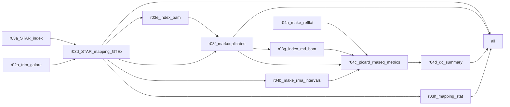

# Joint Exome/Transcriptome Mutation Prioritisation in Low SZ-PRS Brain
This LPB project, low PRS SZ brain, exome & transcriptome analysis

<!  >

## Ia. Variant-calling and annotation: reference data acquisition and post-processing
*scripts\lpb-exome-priritisation-collect-data.sh*<br>
A bash pipeline (download_references.sh) was developed to assemble all reference and annotation resources required by the variant-calling and annotation workflow. The script is idempotent, supports atomic resumption after interruption, and produces a manifest (TSV format) recording each managed file's path, size, SHA-256 hash, source URL, and validation status.

Usage:
```sh
sudo chmod +x lpb-exome-priritisation-collect-data.sh
bash lpb-exome-priritisation-collect-data.sh
```
The disk space requirement: ~350Gb for the reference data + ~12Gb per exome.

### Under the hood:
#### 1. Reference genome and known-sites VCFs
The GRCh38 reference assembly with ALT contigs (Homo_sapiens_assembly38.fasta) and its FAI/dict indices were obtained from the Broad Institute's public Google Cloud bucket (gcp-public-data--broad-references/hg38/v0). Known-sites VCFs for GATK BQSR — HapMap 3.3, the Mills and 1000 Genomes gold-standard indels, and dbSNP 138 — were retrieved from the same source.

#### 2. Functional annotation infrastructure
Ensembl VEP cache release 112 was downloaded from ftp.ensembl.org. VEP plugin source code was cloned from two repositories: the official Ensembl VEP_plugins repository pinned to release/115 (required for dbNSFP v5 column-layout compatibility), and the LOFTEE plugin from the konradjk/loftee repository on the grch38 branch. To accommodate VEP's single-directory plugin-loading model, all .pm files from both repositories were copied into a single canonical directory (plugins/flat/); copies (rather than symlinks) avoid Singularity bind-mount path-resolution failures.

#### 3. Plugin data resources
- **AlphaMissense** ([Cheng et al. 2023](https://doi.org/10.1126/science.adg7492)) scores (AlphaMissense_hg38.tsv.gz). Were obtained from the DeepMind public bucket and tabix-indexed.
- **SpliceAI** ([Jaganathan et al. 2019](https://doi.org/10.1016/j.cell.2018.12.015)) single-nucleotide-variant scores. Were downloaded from the Ensembl FTP (Ensembl MANE GRCh38 release 110 mirror).
- **SpliceAI indel scores**. Were obtained *manually* via the Illumina BaseSpace CLI (project 66029966) due to licensing constraints.
- **CADD** v1.7 SNV and indel scores ([Rentzsch et al. 2019](https://doi.org/10.1093/nar/gky1016)). Were retrieved from the University of Washington's CADD distribution.
- **LOFTEE** ([Karczewski et al. 2020](doi:10.1038/s41586-020-2308-7)). LOFTEE supporting data (human ancestor reference, GERP conservation BigWig, and SQL conservation database) were obtained from personal.broadinstitute.org, with aria2 used preferentially for resilience against intermittent peering issues.
- **REVEL** ([Ioannidis et al. 2016](https://doi.org/10.1016/j.ajhg.2016.08.016)) **scores (May 2021 release with Ensembl transcript IDs)**. Downloaded manually from https://sites.google.com/site/revelgenomics/downloads. The panel require explicit transformation to be readable by VEP's REVEL plugin: (i) the published CSV is converted to TSV, (ii) chromosome names are prefixed with "chr" to match the reference assembly's UCSC-style naming, (iii) the column-header line is prefixed with "#" and the file is indexed via tabix -c '#' rather than tabix -S 1, ensuring tabix -h queries return the header line as expected by the plugin's column-detection routine. Two automated sanity checks validate the resulting file: a BRCA1 lookup at chr17:43106478 and a header-retrieval test.
- **dbNSFP** v5.3.1a ([Liu et al. 2011](https://doi.org/10.1002/humu.21517) & [Liu et al. 2020](https://doi.org/10.1186/s13073-020-00803-9)). A collection of functional annotations and mutation effect prediction scores. Was supplied *manually* from genos.us and verified against its upstream MD5 checksum.

#### 4. Population-frequency annotation
- gnomAD v4.1 exome sites VCFs were downloaded per chromosome (autosomes plus X and Y; ~184 GB total). A helper script (gnomad_strip_concat.sh) was generated and auto-invoked to strip each per-chromosome VCF to relevant AF columns (AF, AF_nfe, AF_afr, AF_amr, AF_eas, AF_sas, AF_fin, AF_asj, nhomalt, AC, AN) using bcftools 1.19 in parallel, concatenating the stripped files into a single bgzipped VCF (~30 GB final), and removing per-chromosome originals as each was processed to bound peak disk usage. 

#### 5. Clinical-significance annotation
ClinVar GRCh38 was retrieved from a dated NCBI archive snapshot (archive_2.0/2026/clinvar_20260426.vcf.gz). ClinVar is attached to variants in the VEP step via --custom annotation, which copies the CLNSIG (clinical significance), CLNDN (disease name), CLNREVSTAT (review status), and CLNDISDB (disease database cross-references) INFO fields from the ClinVar record at matching coordinates onto the variant being annotated.

#### 6. Gene panels
*all downloaded manually*<br>
- **SureSelectXT Human All Exon V8 capture-kit BED file** (S33266436_Regions.bed & S33266436_Regions.padded100.interval_list). The capture-kit BED file is supplied externally from [the wet-laboratory provider](https://earray.chem.agilent.com/suredesign/search/entity.htm).
- **SCHEMA, BipEx, and ASC**. Schizophrenia ([Singh et al. 2022](https://doi.org/10.1038/s41586-022-04556-w)), bipolar ([Palmer et al. 2022](https://doi.org/10.1038/s41588-022-01034-x)), and ASD ([Satterstrom et al. 2020](https://doi.org/10.1016/j.cell.2019.12.036)) gene-burden results were obtained as TSV files from the [SCHEMA](https://atgu-exome-browser-data.s3.amazonaws.com/SCHEMA/SCHEMA_gene_results.tsv.bgz), [BipEx](https://atgu-exome-browser-data.s3.amazonaws.com/BipEx/BipEx_gene_results.tsv.bgz), and [ASC](https://atgu-exome-browser-data.s3.amazonaws.com/ASC/ASC_gene_results.tsv.bgz) web applications, respectively. The gene results were joined to HGNC symbols via the gnomAD constraint table (Ensembl gene-ID match) for downstream gene-symbol-based filtering.
- **The DDG2P / Genomics England PanelApp panel (ID 484)**. The panel was retrieved via the panel's TSV download endpoint, with a JSON-API fallback and automated JSON-to-TSV conversion.

#### 7. Validation
Final completeness validation iterates over expected files, confirming non-zero size and presence of required indices (.tbi for VCF/TSV.gz, .fai/.dict for FASTA). Version coherence between VEP cache, plugin branch, and dbNSFP release is enforced at startup. Post-processing failures (REVEL conversion, SCHEMA HGNC join, gnomAD strip+concat, plugin flattening) propagate to the script's exit code.

## Ib. Variant-calling and annotation: pipeline
*scripts\lpb-exome-prioritisation-pipe.smk*<br>
A 27-rule Snakemake workflow processes paired-end whole-exome sequencing data from raw FASTQ to tier-classified candidate variant tables suitable for downstream DROP monoallelic-expression analysis. Each rule executes inside a per-tool Singularity container, ensuring tool-version reproducibility; rules are designed to resume from intermediate outputs after interruption.

### Usage
- Exomes are provided in the mounted /tmp/fastq folder
- Tested in a snakemake container in Intel Ice Lake VM with 6 cores and 96Gb RAM with Ububntu 24.04 LTS
Run snakemake container (yes, containers in the snakemake container is a choice).
```sh
sudo docker container run --rm --privileged -it \
-v "${PWD}:/tmp" \
-e SINGULARITY_TMPDIR=/tmp/sing_tmp \
-e SINGULARITY_CACHEDIR=/tmp/sing_tmp/cache \
-e TMPDIR=/tmp/sing_tmp \
snakemake/snakemake:v8.20.0
# inside the container
snakemake --snakefile /tmp/repo/lpb-exome-prioritisation-pipe.smk \
    --cores 6 \
    --software-deployment-method apptainer \
    --apptainer-prefix sing \
    --apptainer-args "--home ${HOME}" \
    --rerun-incomplete -n
```
The disk space requirement: ~350Gb for the reference data + ~12Gb per exome.

### Under the hood


```mermaid
flowchart LR
	id0[all]
	id1[r10_per_sample_vcf]
	id2[r09_normalize]
	id3[r08e_merge_and_pass]
	id4[r08c_hardfilter_snps]
	id5[r08a_select_snps]
	id6[r07_genotypegvcfs]
	id7[r06_genomicsdbimport]
	id8[r05_haplotypecaller_gvcf]
	id9[r04b_apply_bqsr]
	id10[r03_markduplicates_spark]
	id11[r02b_sort_index]
	id12[r02a_bwamem2_align]
	id13[r01_fastp_trim]
	id14[r000c_bwamem2_index]
	id15[r04a_bqsr_table]
	id16[r000a_samtools_faidx]
	id17[r000b_picard_dict]
	id18[r000d_make_intervals]
	id19[r08d_hardfilter_indels]
	id20[r08b_select_indels]
	id21[r12_tier_candidates]
	id22[r11_vep_annotate_cohort]
	id23[r09e_artifact_blacklist]
	id24[r09d_pick_representatives]
	id25[r09c_kinship_table]
	id26[r09b_make_plink_bed]
	id23 --> id0
	id24 --> id0
	id1 --> id0
	id21 --> id0
	id25 --> id0
	id2 --> id1
	id3 --> id2
	id4 --> id3
	id19 --> id3
	id5 --> id4
	id6 --> id5
	id7 --> id6
	id18 --> id7
	id8 --> id7
	id9 --> id8
	id18 --> id8
	id10 --> id9
	id15 --> id9
	id11 --> id10
	id12 --> id11
	id13 --> id12
	id14 --> id12
	id17 --> id15
	id16 --> id15
	id10 --> id15
	id18 --> id15
	id17 --> id18
	id20 --> id19
	id6 --> id20
	id22 --> id21
	id23 --> id21
	id1 --> id21
	id2 --> id22
	id2 --> id23
	id24 --> id23
	id25 --> id24
	id26 --> id24
	id26 --> id25
	id2 --> id26
```

#### 1. Read processing and alignment
Adapter and quality trimming was performed with fastp 0.23.4 using default Illumina-adapter detection. Trimmed reads were aligned to GRCh38 (with ALT contigs) using BWA-MEM2 v2.2.1 (rule r02a_bwamem2_align), with read-group tags injected for sample identification. Alignments were coordinate-sorted and indexed with samtools 1.19. PCR/optical duplicates were marked using GATK MarkDuplicatesSpark (GATK 4.5.0.0), which performs sorting and duplicate marking in a single Spark-parallelized pass.

#### 2. Base-quality recalibration
*probably redundant*<br>
GATK BaseRecalibrator computed per-read-group covariates against HapMap 3.3, Mills/1000G indels, and dbSNP 138 known-sites VCFs (rule r04a_bqsr_table). ApplyBQSR produced recalibrated BAMs.

#### 3. Variant calling and joint genotyping
Per-sample GVCFs were produced by GATK HaplotypeCaller in -ERC GVCF mode. The cohort GVCFs were imported into a per-cohort GenomicsDB datastore (r06_genomicsdbimport), and joint genotyping was performed across all samples by GATK GenotypeGVCFs (r07_genotypegvcfs). Joint calling was chosen over per-sample calling to share evidence at borderline-quality sites; SNV and indel cohort sizes (n=32) below the VQSR threshold made hard filtering preferable to model-based recalibration.

#### 4. Hard filtering
Following GATK best practices for small cohorts, SNVs and indels were extracted and filtered separately. SNV filters: QD < 2.0, FS > 60.0, MQ < 40.0, MQRankSum < -12.5, ReadPosRankSum < -8.0, SOR > 3.0. Indel filters: QD < 2.0, FS > 200.0, ReadPosRankSum < -20.0, SOR > 10.0. Filtered SNVs and indels were merged and PASS-filtered (r08e_merge_and_pass).

#### 5. Normalization
The cohort VCF was left-aligned and multiallelics were split using bcftools norm -m -any --check-ref w against the reference FASTA (rule r09_normalize).

#### 6. Internal artifact filtering
*this step requires an exome panel, at least couple dozens samples*<br>
Four rules implement relatedness-aware artifact filtering. PLINK2 (v2.00a5.10) with autosome restriction and MAF/genotype-rate filters (--maf 0.05 --geno 0.05 --hwe 1e-6) produced a BED file from the cohort VCF (r09b_make_plink_bed); KING-format kinship coefficients were computed via --make-king-table (r09c_kinship_table). A custom Python helper (*scripts\lpb-exome-prioritisation-pick-family-representatives.py*) performed connected-component analysis on related-pair edges (KING kinship ≥ 0.0442, the third-degree-relative threshold), retaining one lexicographically-first representative per family (r09d_pick_representatives). The cohort VCF was then subset to representatives and re-tagged with bcftools +fill-tags AC,AN; sites with AC ≥ 2 among representatives that were absent or rare (AF < 0.001) in gnomAD v4.1 were flagged as artifact-suspect tuples (r09e_artifact_blacklist). This procedure removes recurrent batch / mapping / sample-prep artifacts that gnomAD-AF filtering alone cannot detect, while avoiding false positives from variants shared across related samples.

#### 7. Per-sample VCF extraction
The cohort VCF was demultiplexed into per-sample VCFs by bcftools 1.19 with private-variant retention (r10_per_sample_vcf).
Functional annotation. The cohort VCF was annotated by Ensembl VEP 112 (rule r11_vep_annotate_cohort) using the offline cache, MANE-Select / canonical / biotype transcript prioritization (--pick_allele_gene --pick_order mane_select,canonical,biotype), and HGVS notation. Plugins were loaded from a flattened directory and included AlphaMissense, REVEL, LOFTEE (high-confidence loss-of-function flag), CADD v1.7, SpliceAI (max delta scores across acceptor/donor gain/loss), and dbNSFP v5.3.1a fields (MutationTaster_pred, PROVEAN_pred, MetaLR_pred, MetaRNN_pred, M-CAP_pred, PrimateAI_pred, ClinPred_pred, BayesDel_addAF_pred). VEP --custom annotations attached gnomAD v4.1 exome population-stratified allele frequencies and ClinVar clinical-significance fields.

#### 8. Tier classification
*scripts\lpb-exome-prioritisation-tier-candidates.py*<br>
A Python script classifies per-sample variants into three tiers (rule r12_tier_candidates). Common variants (gnomAD popmax AF ≥ 0.001) and internal artifact sites are filtered first. Outputs comprise three tier-specific TSVs and a master TSV containing all rare-variant calls with the tier label as the leading column.
- **Tier A** captures DROP-testable predicted loss-of-function and splice-disrupting variants (LOFTEE high-confidence LoF, or SpliceAI max delta ≥ 0.20).
- **Tier B** captures rank-only damaging missense candidates in constrained genes (gnomAD LOEUF < 0.35) by AlphaMissense likely-pathogenic class (score ≥ 0.564) or REVEL ≥ 0.75.
- **Tier C** captures any rare protein-altering variant in a curated gene set (SCHEMA at FDR ≤ 0.25, ASC at FDR ≤ 0.25, or DDG2P confidence ≥ 2). Per-panel boolean membership flags and panel-specific annotation columns (e.g., SCHEMA Q meta, OR for protein-truncating variants; DDG2P mode-of-inheritance and aggregated phenotypes) are appended to all output tables. BipEx burden statistics are reported as annotation only and do not define Tier C panel membership.

## II. RNA-seq alignment and QC pipeline for DROP
*scripts\lpb-rnaseq-pipe.smk*<br>
A Snakemake workflow processes paired-end (or single-end) RNA-seq FASTQ files into STAR-aligned, duplicate-marked BAM files suitable as input to the DROP framework (Yépez et al. 2021) for monoallelic-expression, expression-outlier, and splicing-outlier detection. Alignment parameters and reference files match the GTEx Analysis V11 RNA-seq pipeline exactly, allowing direct merging of the resulting gene-level read counts with the GTEx V11 expression matrix for OUTRIDER reference-panel expansion.

### Usage
```sh
export SMK_DIR=/path/to/lpb-exome-prioritisation-pipe
mkdir -p ${PWD}/sing_tmp
sudo docker container run --rm --privileged -it \
    -v "${PWD}:/tmp/data" \
    -v "${SMK_DIR}:/tmp/repo" \
	-v "${PWD}/sing_tmp:/tmp/sing_tmp" \
    -e APPTAINER_TMPDIR=/tmp/sing_tmp \
    -e APPTAINER_CACHEDIR=/tmp/sing_tmp/cache \
    -e TMPDIR=/tmp/sing_tmp \
snakemake/snakemake:v8.20.0
# run inside the container
time snakemake --snakefile /tmp/repo/lpb-rnaseq-pipe.smk --cores 4 --use-singularity --singularity-prefix sing --singularity-args "--home ${HOME}" --rerun-triggers mtime -n
```

The disk space requirement: ~35Gb for genome, annotation and STAR index + ~??Gb per transcriptome.

### Under the hood


#### 1. Reference assembly and annotation
The reference genome is Homo_sapiens_assembly38_noALT_noHLA_noDecoy.fasta (the GTEx-specific GRCh38 build with ALT, HLA, and decoy contigs removed; obtainable from the Broad TOPMed bucket or from ENCODE as a drop-in equivalent). Gene annotation is GENCODE v47 (gencode.v47.GRCh38.annotation.gtf), matching the GTEx V11 release. The STAR genome index is built once with --sjdbOverhang set to the user's read length minus one (configurable at the top of the Snakefile via READ_LENGTH); for parity with GTEx's 2x76bp reads, set READ_LENGTH = 76.

#### 2. Read trimming
Adapter and quality trimming is performed with Trim Galore (default Illumina-adapter detection). The step can be disabled (USE_TRIMMING = False) for strict GTEx parity, in which case STAR's soft-clipping handles adapter contamination.

#### 3. STAR alignment
STAR 2.7.11b (rule r03d_STAR_mapping_GTEx) aligns the trimmed reads to the indexed genome using the exact parameter set from the Broad GTEx pipeline's run_STAR.py: --twopassMode Basic, --outFilterMultimapNmax 20, --outFilterType BySJout, --outFilterMismatchNoverLmax 0.1, --alignIntronMin 20, --alignIntronMax 1000000, --limitSjdbInsertNsj 1200000, --outFilterScoreMinOverLread 0.33, --outFilterMatchNminOverLread 0.33, --alignSoftClipAtReferenceEnds Yes, --quantMode TranscriptomeSAM GeneCounts, --outSAMtype BAM SortedByCoordinate, --outSAMunmapped Within, with chimeric-detection flags (--chimSegmentMin 15, --chimJunctionOverhangMin 15, --chimOutType Junctions WithinBAM SoftClip, --chimMainSegmentMultNmax 1) per the TOPMed/GTEx convention. Per-sample read-group tags (ID:{sample} SM:{sample} PL:ILLUMINA LB:lib1) are injected via --outSAMattrRGline for downstream-tool compatibility. The two-pass mode and BySJout filter together substantially improve novel-junction detection, which is important for FRASER's splice-outlier analysis. STAR produces three outputs per sample: a coordinate-sorted genome-aligned BAM, a transcriptome-coordinate BAM (for downstream RSEM if needed), the gene-level read-count table (ReadsPerGene.out.tab, mergeable with the GTEx V11 count matrix), the splice-junction table (SJ.out.tab, used by FRASER), and a chimeric-junction file. Aligned BAMs are indexed by samtools 1.9 (rule r03e_index_bam).

#### 4. Duplicate marking
Picard MarkDuplicates 2.27.5 (rule r03f_markduplicates) marks PCR/optical duplicates on the coordinate-sorted BAM, producing the canonical GTEx-style filename {sample}.Aligned.sortedByCoord.out.patched.md.bam. The "patched" suffix is retained for naming consistency with the GTEx convention even though bamsync (which would carry QC flags from a pre-existing CRAM in GTEx's own pipeline) is not applied here, since alignment starts from raw FASTQ. The MD'd BAM is the canonical input for the DROP MAE, OUTRIDER, and FRASER modules and is indexed by samtools (rule r03g_index_md_bam).

#### 5. Mapping statistics aggregation
Per-sample STAR Log.final.out files are parsed into a single TSV (rule r03h_mapping_stat, 00_mapping_stat/mapping_stat.txt) reporting input read counts, uniquely mapped read counts and percentages, multi-mapped percentages, "too many loci" rates, and unmapped fractions per sample.

#### 6. RNA-seq quality control
 Picard CollectRnaSeqMetrics 2.27.5 (rule r04c_picard_rnaseq_metrics) is run per-sample to produce comprehensive RNA-seq quality metrics. The required UCSC refFlat annotation is generated once from the GENCODE v47 GTF using ucsc-gtfToGenePred -genePredExt -geneNameAsName2 followed by column-reordering to refFlat format (rule r04a_make_refflat). A Picard interval-list of ribosomal RNA loci is generated once from the same GTF by selecting gene_type "rRNA" and gene_type "Mt_rRNA" features and combining them with the BAM's @SQ header lines (rule r04b_make_rrna_intervals). CollectRnaSeqMetrics is run with STRAND_SPECIFICITY=NONE (preserving 3' bias and rRNA detection regardless of library protocol) and VALIDATION_STRINGENCY=LENIENT to accommodate STAR-output BAMs. The resulting per-sample metrics are aggregated into a cohort summary table (rule r04d_qc_summary, 04_qc/00_qc_summary.tsv) reporting:
 - PCT_RIBOSOMAL_BASES
 - PCT_CODING_BASES
 - PCT_UTR_BASES
 - PCT_INTRONIC_BASES
 - PCT_INTERGENIC_BASES
 - PCT_MRNA_BASES
 - PCT_USABLE_BASES
 - MEDIAN_CV_COVERAGE
 - MEDIAN_5PRIME_BIAS
 - MEDIAN_3PRIME_BIAS
 - MEDIAN_5PRIME_TO_3PRIME_BIAS
 Three flag columns identify outlier samples: flag_3prime_bias_high fires when a sample's MEDIAN_3PRIME_BIAS exceeds the cohort median plus three median-absolute-deviations (cohort-relative outlier detection that adapts to the protocol's baseline); flag_rrna_high fires when PCT_RIBOSOMAL_BASES exceeds 10% (depletion-failure threshold); flag_mrna_low fires when PCT_MRNA_BASES falls below 60% (genomic-DNA or pre-mRNA contamination threshold). These flags identify samples with degraded RNA, failed rRNA depletion, or DNA contamination — all of which compromise downstream DROP analyses, particularly OUTRIDER (where degradation-induced low expression of long transcripts produces false expression outliers) and MAE (where coverage non-uniformity invalidates allelic-ratio estimates at variant sites in poorly-covered transcript regions).

#### 7. Pipeline outputs
 Per sample: {sample}.Aligned.sortedByCoord.out.patched.md.bam plus index (canonical DROP input), {sample}.SJ.out.tab (FRASER input), {sample}.ReadsPerGene.out.tab (OUTRIDER input, mergeable with GTEx V11 counts), {sample}.Aligned.toTranscriptome.out.bam (RSEM input if needed), {sample}.Chimeric.out.junction, {sample}.Log.final.out, {sample}.markdup_metrics.txt, and {sample}.rnaseq_metrics.txt. Cohort-level: 00_mapping_stat/mapping_stat.txt (alignment summary) and 04_qc/00_qc_summary.tsv (RNA-seq QC summary with outlier flags).

## AI disclosure
Scripts were produced with assistance from Claude Opus 4.7